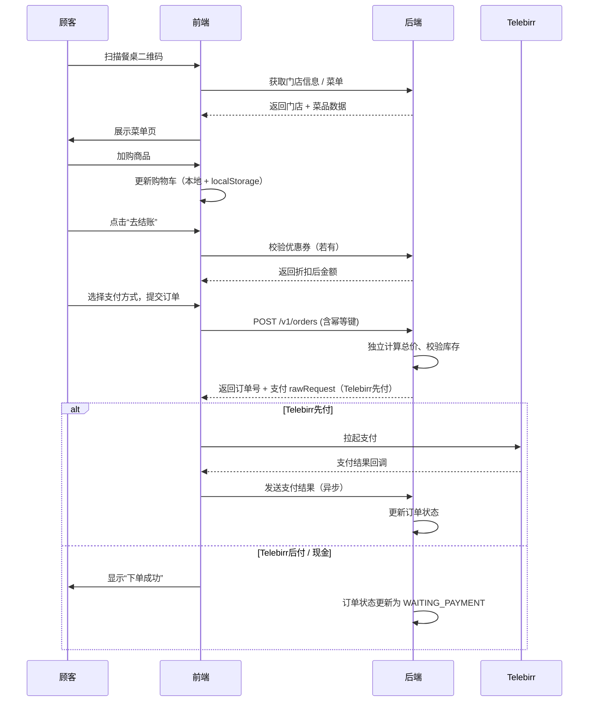
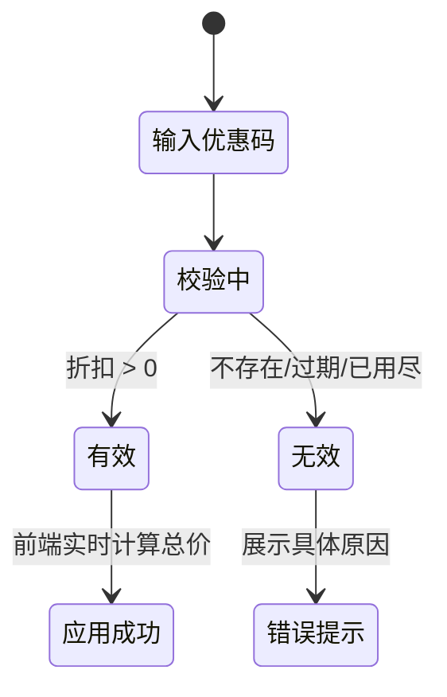
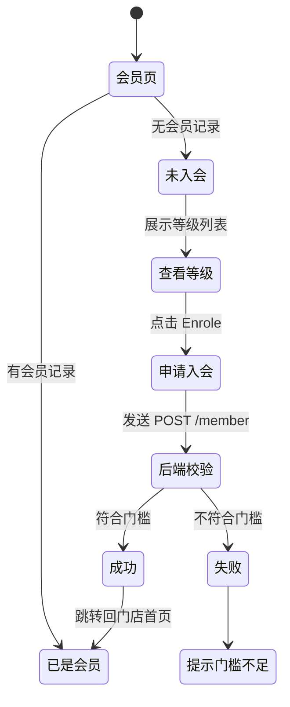
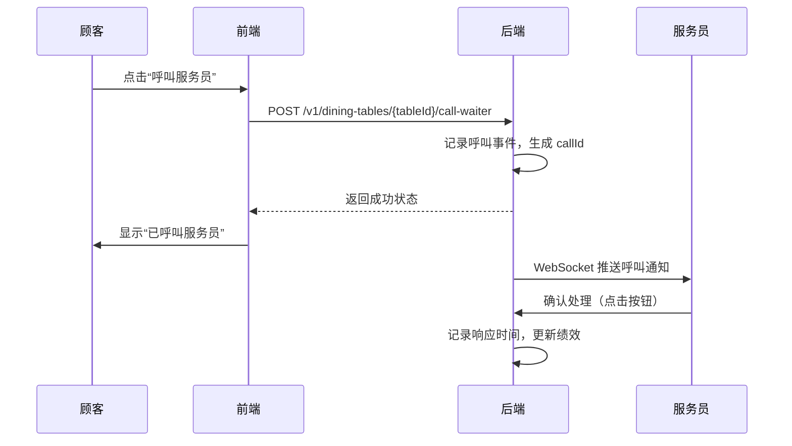
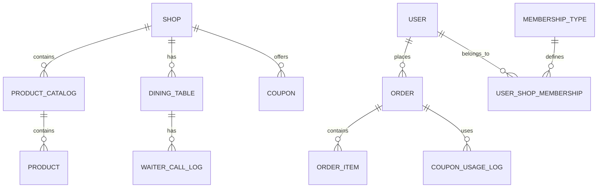

# E-Joy 产品设计文档

> **版本**：V2.0  
> **更新日期**：2026-03-31  
> **作者**：技术合伙人（兼产品经理）  
> **目标**：为研发团队提供完整的产品定义、技术方案、UI 设计指南和开发计划，确保高效交付。

---

## 目录

1. [产品概述](#1-产品概述)
2. [核心功能模块](#2-核心功能模块)
3. [业务流程设计](#3-业务流程设计)
4. [数据模型](#4-数据模型)
5. [API 设计](#5-api-设计)
6. [UI 设计提示词](#6-ui-设计提示词)
7. [非功能需求](#7-非功能需求)
8. [开发计划与里程碑](#8-开发计划与里程碑)
9. [附录](#9-附录)

---

## 1. 产品概述

### 1.1 产品定位

**E-Joy** 是一款面向餐厅顾客的移动端自助点餐与支付应用。顾客通过扫描餐桌二维码进入对应门店，浏览菜单、下单、使用优惠券、申请会员、查看历史订单，并集成当地主流移动支付（Telebirr）。同时，为餐厅提供轻量级员工管理工具（后续版本），帮助提升服务效率和 App 推广能力。

### 1.2 目标用户

| 角色 | 描述 | 使用场景 |
|------|------|----------|
| 顾客 | 到店用餐的消费者 | 扫码点餐、支付、查看订单、使用优惠券、申请会员 |
| 服务员（后续） | 餐厅服务人员 | 接收呼叫、处理订单、查看绩效、推广 App |
| 餐厅管理员（后续） | 餐厅经营者或店长 | 管理菜单、优惠券、查看经营数据、考核员工 |

### 1.3 核心价值

- **顾客**：无需排队、自主点餐、快速支付、享受会员权益。
- **餐厅**：降低人力成本、提高翻台率、积累用户数据、提升品牌粘性。
- **平台**：通过会员体系和服务员激励，构建餐厅数字化生态。

---

## 2. 核心功能模块

### 2.1 顾客端功能

| 模块 | 功能点 | 优先级 |
|------|--------|:------:|
| **门店发现** | 附近餐厅列表、搜索、扫码进入 | P0 |
| **菜单浏览** | 菜品分类、商品详情、特价推荐 | P0 |
| **购物车** | 加购、数量调整、删除、清空、备注 | P0 |
| **订单管理** | 创建订单、订单历史、订单详情 | P0 |
| **支付** | Telebirr（先付/后付）、现金支付 | P0 |
| **优惠券** | 查看可用优惠券、校验并应用 | P1 |
| **会员** | 会员等级展示、入会申请、权益说明 | P1 |
| **呼叫服务员** | 一键呼叫、状态反馈 | P1 |
| **关于我们** | 餐厅介绍、社交链接 | P2 |

### 2.2 服务员端功能（后续版本）

| 功能点 | 说明 |
|--------|------|
| 登录与角色认证 | 服务员独立登录，查看专属工作台 |
| 呼叫响应 | 实时接收顾客呼叫，点击“已处理” |
| 绩效看板 | 展示个人响应率、处理量、推广积分等 |
| 推广码 | 生成专属推广码，引导顾客注册 |

### 2.3 餐厅管理员端功能（后续版本）

| 功能点 | 说明 |
|--------|------|
| 员工管理 | 增删改查服务员信息 |
| 考核规则配置 | 设置各指标权重、奖励规则 |
| 数据报表 | 导出员工绩效、推广效果 |

---

## 3. 业务流程设计

### 3.1 扫码点餐完整流程



### 3.2 优惠券使用流程



### 3.3 会员入会流程



### 3.4 呼叫服务员流程



---

## 4. 数据模型

### 4.1 ER 图（核心实体）



### 4.2 关键表结构（Prisma Schema 摘录）

#### 门店与商品

```prisma
model Shop {
  id             String          @id @default(cuid())
  shopKey        String          @unique
  name           String
  logoUrl        String?
  address        String?
  phone          String?
  orderService   Boolean         @default(true)
  productCatalogs ProductCatalog[]
  products       Product[]
  diningTables   DiningTable[]
  coupons        Coupon[]
  createdAt      DateTime        @default(now())
  updatedAt      DateTime        @updatedAt
}

model Product {
  id             String          @id @default(cuid())
  name           String
  description    String?
  unitPrice      Int             // 单位：分
  imageUrl       String?
  available      Boolean         @default(true)
  catalogId      String
  catalog        ProductCatalog  @relation(fields: [catalogId], references: [id])
  createdAt      DateTime        @default(now())
  updatedAt      DateTime        @updatedAt
}
```

#### 订单与订单项

```prisma
model Order {
  id               String        @id @default(cuid())
  orderNo          String        @unique
  idempotentKey    String        @unique
  userId           String
  shopKey          String
  diningTableId    String
  paymentMethod    PaymentMethod
  paymentTime      PaymentTime?
  status           OrderStatus   @default(WAITING_PAYMENT)
  totalAmount      Int           // 后端计算，单位：分
  additionalNote   String?
  couponId         String?
  coupon           Coupon?       @relation(fields: [couponId], references: [id])
  telebirrTxnId    String?
  paidAt           DateTime?
  completedAt      DateTime?
  items            OrderItem[]
  statusLogs       OrderStatusLog[]
  createdAt        DateTime      @default(now())
  updatedAt        DateTime      @updatedAt

  @@index([userId, createdAt])
  @@index([shopKey, status, createdAt])
}

model OrderItem {
  id               String        @id @default(cuid())
  orderId          String
  order            Order         @relation(fields: [orderId], references: [id])
  productId        String
  productName      String        // 快照
  priceSnapshot    Int           // 快照，单位：分
  amount           Int
  subtotal         Int
  remark           String?
  createdAt        DateTime      @default(now())
}

model OrderStatusLog {
  id               String        @id @default(cuid())
  orderId          String
  order            Order         @relation(fields: [orderId], references: [id])
  fromStatus       OrderStatus?
  toStatus         OrderStatus
  operatorType     OperatorType
  operatorId       String?
  reason           String?
  createdAt        DateTime      @default(now())
}
```

#### 用户与会员

```prisma
model User {
  id               String                @id @default(cuid())
  phone            String                @unique
  nickname         String?
  memberships      UserShopMembership[]
  orders           Order[]               // 引用
  createdAt        DateTime              @default(now())
  updatedAt        DateTime              @updatedAt
}

model MembershipType {
  id               String                @id @default(cuid())
  name             String                @unique
  threshold        Int                   // 累计消费门槛，单位：分
  description      String?
  active           Boolean               @default(true)
  memberships      UserShopMembership[]
}

model UserShopMembership {
  id               String                @id @default(cuid())
  userId           String
  user             User                  @relation(fields: [userId], references: [id])
  shopId           String
  membershipTypeId String
  membershipType   MembershipType        @relation(fields: [membershipTypeId], references: [id])
  status           MembershipStatus      @default(ACTIVE)
  totalSpent       Int                   @default(0)
  joinedAt         DateTime              @default(now())
  expiredAt        DateTime?
  createdAt        DateTime              @default(now())
  updatedAt        DateTime              @updatedAt
}
```

#### 优惠券与使用记录

```prisma
model Coupon {
  id               String                @id @default(cuid())
  code             String
  description      String?
  discount         Int                   // 百分比，如 10 = 10%
  validFrom        DateTime
  validUntil       DateTime
  usageLimit       Int                   @default(0)
  usedCount        Int                   @default(0)
  perUserLimit     Int                   @default(1)
  active           Boolean               @default(true)
  shopId           String
  orders           Order[]
  usageLogs        CouponUsageLog[]
  createdAt        DateTime              @default(now())
  updatedAt        DateTime              @updatedAt

  @@unique([code, shopId])
}

model CouponUsageLog {
  id               String                @id @default(cuid())
  couponId         String
  coupon           Coupon                @relation(fields: [couponId], references: [id])
  orderId          String                @unique
  userId           String
  discountAmount   Int                   // 实际折扣金额（快照）
  usedAt           DateTime              @default(now())
}
```

#### 服务员与呼叫记录（后续版本）

```prisma
model Staff {
  id               String                @id @default(cuid())
  shopId           String
  name             String
  phone            String?
  role             String                @default("WAITER") // WAITER, MANAGER
  status           String                @default("ACTIVE")
  createdAt        DateTime              @default(now())
  updatedAt        DateTime              @updatedAt
}

model WaiterCallLog {
  id               String                @id @default(cuid())
  tableId          String
  table            DiningTable           @relation(fields: [tableId], references: [id])
  userId           String
  staffId          String?               // 响应的服务员
  callType         CallType              @default(FIRST_CALL)
  respondedAt      DateTime?
  responseDuration Int?                  // 响应耗时（秒）
  createdAt        DateTime              @default(now())
}

model StaffPerformance {
  id               String                @id @default(cuid())
  staffId          String
  date             DateTime              @map("date")
  callResponseRate Float?
  avgResponseSeconds Int?
  ordersHandled    Int?
  promotionNewUsers Int?
  totalPoints      Int?
  createdAt        DateTime              @default(now())
  updatedAt        DateTime              @updatedAt

  @@unique([staffId, date])
}
```

---

## 5. API 设计

### 5.1 GraphQL Schema（核心）

```graphql
# ===== 基础类型 =====
type Shop @key(fields: "shopKey") {
  id: ID!
  shopKey: String!
  name: String!
  logoUrl: String
  address: String
  phone: String
  orderService: Boolean!
  productCatalogs: [ProductCatalog!]!
  products: [Product!]!
  about: AboutUs
}

type ProductCatalog {
  id: ID!
  name: String!
  displayOrder: Int!
  products: [Product!]!
}

type Product {
  id: ID!
  name: String!
  description: String
  unitPrice: Int!          # 单位：分
  imageUrl: String
  available: Boolean!
  catalogId: ID!
}

type AboutUs {
  description: String
  motto: String
  socialLinks: SocialLinks!
}

type SocialLinks {
  facebook: String
  instagram: String
  tiktok: String
}

# ===== 订单类型 =====
type Order @key(fields: "id") {
  id: ID!
  orderNo: String!
  status: OrderStatus!
  totalAmount: Int!
  paymentMethod: PaymentMethod!
  paymentStatus: PaymentStatus!
  createdAt: DateTime!
  paidAt: DateTime
  completedAt: DateTime
  items: [OrderItem!]!
  shop: Shop!
  user: User!
  diningTable: DiningTable!
  coupon: Coupon
}

enum OrderStatus {
  WAITING_PAYMENT
  PAID
  SERVING
  COMPLETED
  CANCELLED
  REFUND_REQUESTED
  REFUNDED
}

enum PaymentMethod {
  TELEBIRR
  CASH
}

enum PaymentStatus {
  PENDING
  SUCCESS
  FAILED
  REFUNDED
}

type OrderItem {
  id: ID!
  productName: String!
  priceSnapshot: Int!
  amount: Int!
  subtotal: Int!
  remark: String
  productId: ID!
}

# ===== 用户类型 =====
type User @key(fields: "id") {
  id: ID!
  phone: String!
  nickname: String
  memberships: [UserMembership!]!
}

type UserMembership {
  id: ID!
  shop: Shop!
  type: MembershipType!
  status: MembershipStatus!
  totalSpent: Int!
  joinedAt: DateTime!
}

type MembershipType {
  id: ID!
  name: String!
  threshold: Int!
  description: String
}

# ===== 优惠券类型 =====
type Coupon @key(fields: "id") {
  id: ID!
  code: String!
  description: String
  discount: Int!
  validUntil: DateTime!
  shop: Shop!
}

# ===== 餐桌类型 =====
type DiningTable {
  id: ID!
  name: String!
  status: TableStatus!
  currentOrder: Order
}

enum TableStatus {
  AVAILABLE
  OCCUPIED
  CALLING_WAITER
  DIRTY
  MAINTENANCE
}

# ===== Query =====
type Query {
  # 门店相关
  shops(limit: Int = 20, offset: Int = 0, near: LocationInput): ShopPage!
  shop(shopKey: String!): Shop
  searchProducts(shopKey: String!, keyword: String!): [Product!]!

  # 订单相关
  myOrders(status: OrderStatus, limit: Int = 20, offset: Int = 0): OrderPage!
  order(orderId: ID!): Order

  # 用户相关
  me: User!
  membershipTypes: [MembershipType!]!
  myMembership(shopKey: String!): UserMembership

  # 优惠券
  coupons(shopKey: String!): [Coupon!]!
}

# ===== Mutation =====
type Mutation {
  # 认证
  loginWithSuperApp(superAppToken: String!): AuthPayload!

  # 门店相关
  callWaiter(tableId: ID!): CallWaiterResult!

  # 订单相关
  createOrder(input: CreateOrderInput!): OrderPayload!
  applyCoupon(orderId: ID!, couponCode: String!): Order!
  cancelOrder(orderId: ID!): Order!

  # 会员相关
  applyMembership(shopKey: String!, membershipTypeId: ID!): UserMembership!

  # 支付
  initiateTelebirrPayment(orderId: ID!): TelebirrPaymentPayload!
}

# ===== Input Types =====
input CreateOrderInput {
  shopKey: String!
  diningTableId: ID!
  items: [OrderItemInput!]!
  paymentMethod: PaymentMethod!
  paymentTime: PaymentTime!
  additionalNote: String
  couponCode: String
}

input OrderItemInput {
  productId: ID!
  amount: Int!
  remark: String
}

input LocationInput {
  latitude: Float!
  longitude: Float!
}

# ===== Payload Types =====
type AuthPayload {
  accessToken: String!
  refreshToken: String!
  expiresIn: Int!
  user: User!
}

type OrderPayload {
  order: Order!
  telebirrRawRequest: String   # Telebirr 先付时返回
}

type TelebirrPaymentPayload {
  rawRequest: String!
  orderId: ID!
}

type CallWaiterResult {
  success: Boolean!
  message: String!
  callId: ID
}

type OrderPage {
  items: [Order!]!
  total: Int!
  hasMore: Boolean!
}

type ShopPage {
  items: [Shop!]!
  total: Int!
  hasMore: Boolean!
}

# ===== Subscription =====
type Subscription {
  orderStatusUpdated(orderId: ID!): Order!
  waiterCalled(tableId: ID!): CallWaiterResult!
}
```

### 5.2 关键接口说明

| 接口 | 说明 | 关键逻辑 |
|------|------|----------|
| `createOrder` | 创建订单 | 幂等键、后端独立计算总价、记录状态日志、发送 Kafka 事件 |
| `applyCoupon` | 校验并应用优惠券 | 校验有效性、防超领、返回折扣后金额 |
| `applyMembership` | 申请入会 | 校验累计消费门槛、创建会员记录、记录日志 |
| `callWaiter` | 呼叫服务员 | 记录呼叫事件、推送通知、记录响应时间（后续） |

---

## 6. UI 设计提示词

以下为 Figma Make 可用的提示词，可直接粘贴生成页面。

### 6.1 整体设计系统

```
Design System for E-Joy (Mobile & Web)
- Brand Colors: 
  - Primary: #E67E22 (暖橙色)
  - Secondary: #2C3E50 (深蓝灰)
  - Accent: #F39C12 (金黄色)
  - Background: #F8F9FA
  - Surface: #FFFFFF
  - Text Primary: #1A2C3E
  - Text Secondary: #6C757D
  - Success: #27AE60
  - Error: #E74C3C
- Typography:
  - Headlines: Poppins (Bold 600/700)
  - Body: Inter (Regular 400, Medium 500)
  - Prices: Inter (SemiBold 600)
- Spacing: 8px grid system (4,8,16,24,32,48)
- Radius: 16px for cards, 24px for modals, 40px for buttons
- Shadows: Card: 0 2px 8px rgba(0,0,0,0.04), 0 4px 12px rgba(0,0,0,0.02)
- Icon Set: Feather Icons (stroke width 1.5px)
- Animation: Spring easing for cart add; fade for transitions
```

### 6.2 移动端关键页面提示词

#### 餐厅聚合页

```
Create a mobile app screen for "Nearby Restaurants" for a food ordering app called "E-Joy". 
The screen should have:

1. Top bar: User avatar (left), logo "E-Joy" (center), scan QR icon (right).
2. Hero: Large headline "Find your table", subtext "Scan table QR or pick a restaurant near you", and a prominent "Scan QR Code" button.
3. Search bar with placeholder "Search restaurants or dishes...".
4. "Nearby Restaurants" horizontal scroll cards (image, name, rating, distance, "Order" button).
5. "Recommended for you" vertical list with horizontal cards.
6. Bottom navigation: Home (active), Orders, Profile, Favorites, More.

Style: Modern, orange accents, clean white cards, rounded corners.
```

#### 菜单页与购物车

```
Design a mobile app screen for "Menu" with integrated cart for E-Joy.

1. Restaurant header with name, rating, opening hours.
2. Category tabs (horizontal scroll): All, Appetizers, Main Courses, Desserts.
3. Menu grid (2 columns): each card shows image, name, price, plus button.
4. Floating cart button at bottom right showing item count and total price.
5. Tap cart button: bottom sheet slides up showing cart items with quantity controls, subtotal, total, and "Proceed to Checkout" button.

Style: Cards with subtle shadow, orange CTA buttons. Use spring animation for add-to-cart.
```

#### 结账页

```
Design a mobile checkout screen for E-Joy.

1. Progress indicator: Cart → Payment → Confirm (current: Payment).
2. Order summary card with items, subtotal, discount, total.
3. Customer details: name (pre-filled), table number (read-only), additional notes textarea.
4. Payment method selection: Telebirr and Cash. If Telebirr, show toggle "Pay now / Pay later".
5. Coupon section: input field with "Apply" button.
6. Large orange "Confirm Order" button.
7. Small disclaimer text.

Style: Trustworthy, clear hierarchy, use Inter font.
```

#### 会员页

```
Design a mobile app screen for "E-Joy Rewards" membership.

1. Header: "E-Joy Rewards" with back button.
2. Current tier card: show tier name (e.g., "Gold Member"), progress bar to next tier, current spending.
3. Membership benefits list with icons.
4. All tiers showcase (horizontal scroll): Basic, Silver, Gold, Platinum with thresholds and "Join" button.
5. "How it works" section with steps.
6. Outline button "Learn more about Rewards".

Style: Gold accents for premium tiers, clean illustrations.
```

### 6.3 桌面 Web 页面提示词（宽屏）

#### 聚合页（Web）

```
Design a responsive web page for E-Joy restaurant discovery.

1. Header: Logo left, navigation (Restaurants, Offers, Help, Sign in), "Scan QR" button.
2. Hero: Large headline "Order from your table, faster", subhead, two buttons "Find a restaurant" (orange) and "How it works" (outline).
3. Centered search bar with filters.
4. Restaurant grid (3-4 columns): cards with image, name, rating, cuisine, delivery time, "Order Now" link.
5. "Special Offers" carousel.
6. Footer with links.

Style: Spacious, modern, orange accents.
```

---

## 7. 非功能需求

### 7.1 性能指标

| 指标 | 目标值 |
|------|--------|
| 首屏加载时间 | < 3s (3G 网络) |
| API 响应时间 (P95) | < 800ms |
| 订单创建接口 | < 500ms (不含支付) |
| 数据库查询 | < 100ms (有索引) |

### 7.2 安全要求

- **认证授权**：JWT + httpOnly Cookie（或 localStorage 临时方案），所有敏感接口校验 token。
- **数据加密**：密码（无）、手机号需脱敏展示；支付敏感信息不落地。
- **防篡改**：订单金额后端独立计算，与前端传入比对，差异超过阈值记录风控日志。
- **SQL 注入**：使用 Prisma ORM 参数化查询。
- **XSS/CSRF**：使用 CSP 头，GraphQL 查询禁用内联脚本。

### 7.3 可用性

- 支持移动端（iOS/Android）和桌面端浏览器（Chrome, Safari）。
- 提供加载状态、空状态、错误提示。
- 支持离线购物车（localStorage 持久化）。

### 7.4 可扩展性

- 微服务架构，各服务独立部署。
- GraphQL Federation 支持多服务聚合。
- 消息队列解耦支付、通知等非核心链路。

---

## 8. 开发计划与里程碑

### 8.1 迭代规划

| 阶段 | 时间 | 内容 | 交付物 |
|------|------|------|--------|
| **Sprint 0** | 第 1 周 | 环境搭建、技术选型、CI/CD | Docker Compose 环境、GitHub Actions 流水线、项目骨架 |
| **Sprint 1** | 第 2-3 周 | 用户认证、门店菜单模块 | 用户登录、门店列表、菜单浏览、GraphQL API 基础 |
| **Sprint 2** | 第 4-5 周 | 购物车、订单创建、支付集成 | 购物车功能、订单创建、Telebirr 沙箱集成 |
| **Sprint 3** | 第 6 周 | 优惠券、会员模块 | 优惠券校验、会员入会 |
| **Sprint 4** | 第 7 周 | 订单历史、呼叫服务员 | 订单列表/详情、呼叫服务员 |
| **Sprint 5** | 第 8 周 | 集成测试、性能优化、部署 | 端到端测试、压测、生产环境部署 |
| **后续** | V2.1 | 服务员管理、考核功能 | 员工端、绩效看板、推广码 |

### 8.2 关键里程碑

- **Week 2**：完成基础设施，可以本地运行全栈服务。
- **Week 4**：完成核心下单流程，可模拟支付。
- **Week 6**：完成优惠券和会员功能，具备完整业务闭环。
- **Week 8**：生产环境上线，开始灰度发布。

---

## 9. 附录

### 9.1 技术栈清单

| 类型 | 技术 |
|------|------|
| 前端 | React 18 + TypeScript + Vite + TailwindCSS + Radix UI |
| 状态管理 | Zustand |
| 数据获取 | TanStack Query (React Query) |
| API 客户端 | Apollo Client (GraphQL) |
| 后端框架 | NestJS |
| API 层 | GraphQL + Apollo Federation |
| ORM | Prisma |
| 数据库 | PostgreSQL 17 + Citus (未来) |
| 缓存 | Redis 7.4 |
| 消息队列 | Apache Kafka |
| 搜索 | Meilisearch |
| 对象存储 | Cloudflare R2 / AWS S3 |
| 容器编排 | Docker + Kubernetes (生产) |
| CI/CD | GitHub Actions + ArgoCD |
| 可观测性 | OpenTelemetry + Jaeger + Prometheus + Grafana + Loki |

### 9.2 环境变量清单

| 变量名 | 说明 |
|--------|------|
| `DATABASE_URL` | PostgreSQL 连接串 |
| `REDIS_URL` | Redis 连接串 |
| `KAFKA_BROKERS` | Kafka broker 地址列表 |
| `JWT_SECRET` | JWT 签名密钥 |
| `TELEBIRR_APP_ID` | Telebirr 应用 ID |
| `TELEBIRR_APP_SECRET` | Telebirr 应用密钥 |
| `TELEBIRR_CALLBACK_URL` | Telebirr 支付回调地址 |
| `MEILISEARCH_HOST` | Meilisearch 服务地址 |
| `MEILISEARCH_KEY` | Meilisearch 主密钥 |

---

**文档结束**