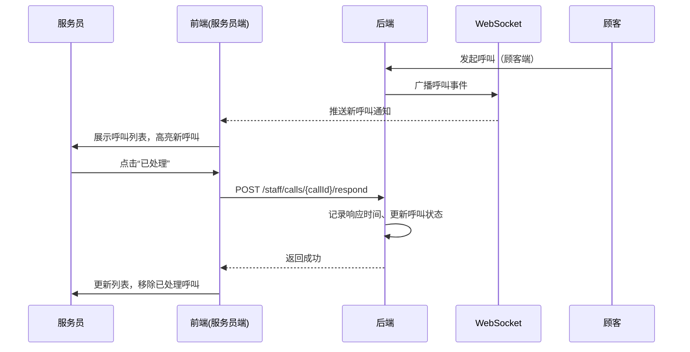
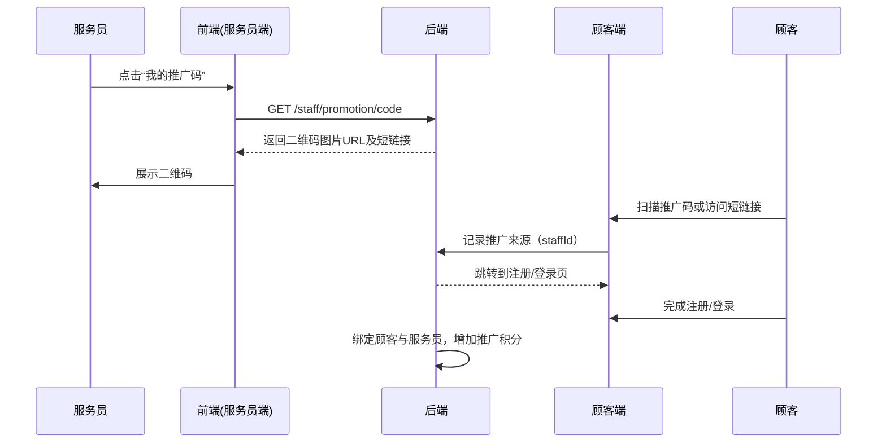
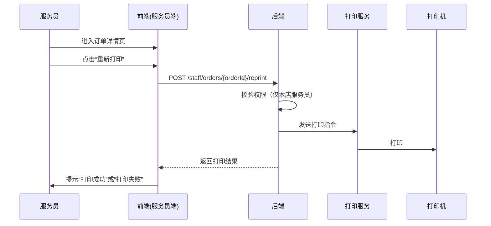
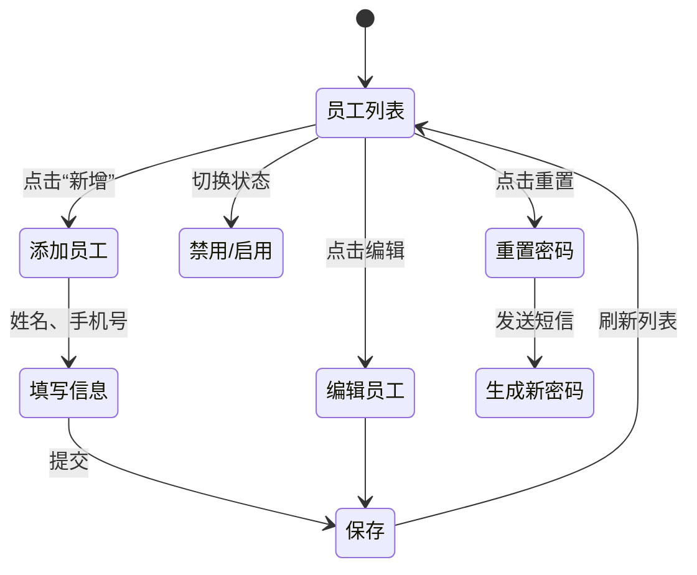
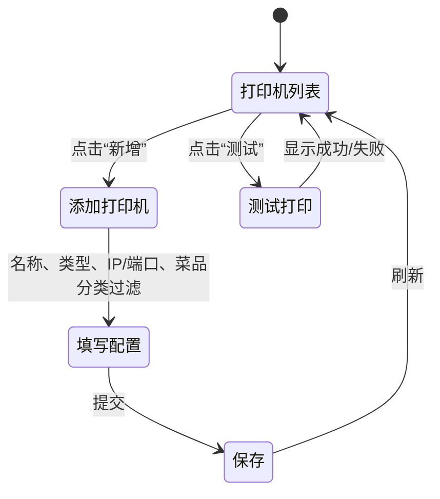
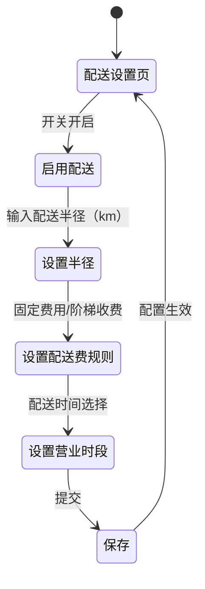
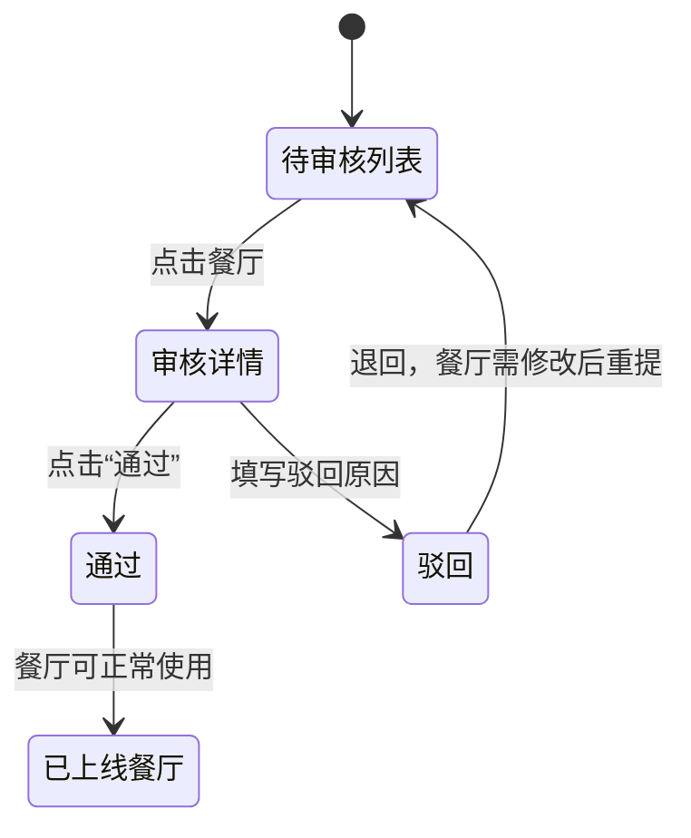
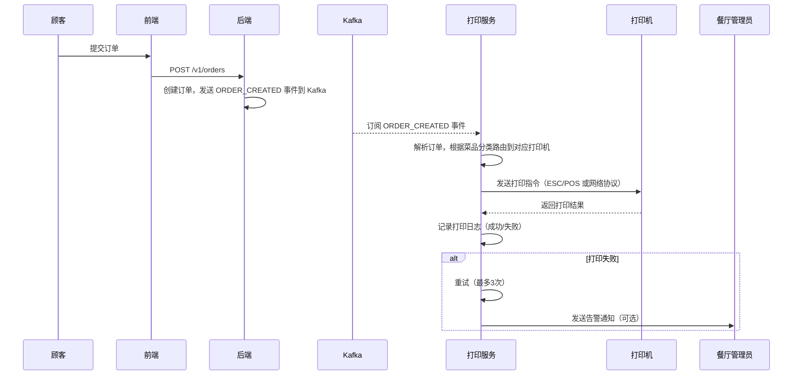
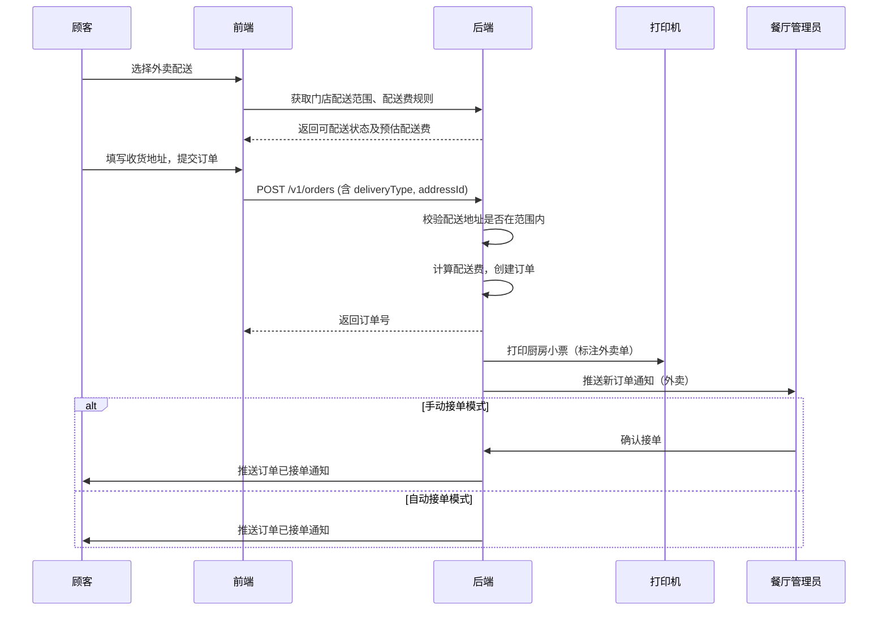
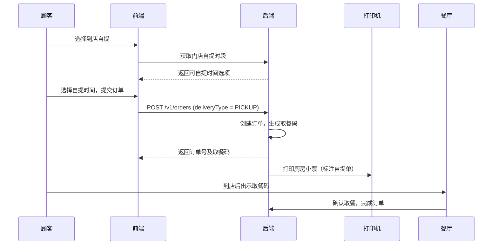

# E-Joy V2.1 产品设计文档（完整版）

> **版本**：V2.1  
> **更新日期**：2026-04-01  
> **作者**：技术合伙人（兼产品经理）  
> **定位**：在 V2.0 顾客端基础上，扩展服务员端、餐厅管理员端、系统后台端、订单自动打印及外卖配送能力，形成覆盖堂食、自提、外卖的完整餐厅数字化运营闭环。

---

## 目录

1. [产品概述](#1-产品概述)
2. [角色与权限矩阵](#2-角色与权限矩阵)
3. [服务员端功能设计](#3-服务员端功能设计)
4. [餐厅管理员端功能设计](#4-餐厅管理员端功能设计)
5. [系统后台端功能设计](#5-系统后台端功能设计)
6. [打印功能设计](#6-打印功能设计)
7. [外卖配送功能设计](#7-外卖配送功能设计)
8. [数据模型扩展](#8-数据模型扩展)
9. [API 设计](#9-api-设计)
10. [UI 设计提示词](#10-ui-设计提示词)
11. [非功能需求](#11-非功能需求)
12. [开发计划与里程碑](#12-开发计划与里程碑)

---

## 1. 产品概述

### 1.1 产品定位

**E-Joy** 是一套面向餐厅的数字化解决方案，目前已具备顾客端自助点餐与支付能力（V2.0）。V2.1 将补齐**服务员端**（移动端）、**餐厅管理员端**（Web 管理后台）、**系统后台端**（平台级管理）以及**订单自动打印功能**，并新增**外卖配送能力**（支持到店自提与外卖配送），实现从顾客下单到后厨制作再到员工激励的完整业务闭环，覆盖堂食、自提、外卖三大场景。

### 1.2 目标用户

| 角色 | 描述 | 使用场景 | 终端 |
|------|------|----------|------|
| 服务员 | 餐厅一线服务人员 | 接收呼叫、处理订单、查看绩效、推广 App | 移动端（H5/小程序） |
| 餐厅管理员 | 餐厅经营者或店长 | 管理员工、配置考核规则、查看经营数据、配置打印机、设置配送规则 | Web 管理后台 |
| 系统管理员 | 平台运营人员 | 管理餐厅入驻、审核优惠券、查看平台数据 | Web 系统后台 |

### 1.3 核心价值

- **服务员**：工作有据可依，激励透明，提升收入与成就感。
- **餐厅管理者**：量化员工表现，优化服务效率，降低管理成本，实现后厨自动化打印，拓展外卖业务。
- **平台**：通过服务员推广加速用户增长，沉淀数据，构建堂食+外卖一体化解决方案。

---

## 2. 角色与权限矩阵

| 功能模块 | 服务员 | 餐厅管理员 | 系统管理员 |
|----------|:------:|:----------:|:----------:|
| 登录认证 | ✅ | ✅ | ✅ |
| 查看呼叫列表 | ✅ | ✅ | ❌ |
| 处理呼叫 | ✅ | ❌ | ❌ |
| 个人绩效看板 | ✅ | ❌ | ❌ |
| 生成推广码 | ✅ | ❌ | ❌ |
| 订单补打 | ✅ | ❌ | ❌ |
| 员工管理（增删改查） | ❌ | ✅ | ❌ |
| 考核规则配置 | ❌ | ✅ | ❌ |
| 打印机配置 | ❌ | ✅ | ❌ |
| 餐厅经营报表 | ❌ | ✅ | ❌ |
| 打印日志查看 | ❌ | ✅ | ❌ |
| 配送范围与规则配置 | ❌ | ✅ | ❌ |
| 外卖订单接单管理 | ❌ | ✅ | ❌ |
| 餐厅入驻审核 | ❌ | ❌ | ✅ |
| 平台优惠券管理 | ❌ | ❌ | ✅ |
| 平台数据大盘 | ❌ | ❌ | ✅ |

---

## 3. 服务员端功能设计

### 3.1 功能清单

| 功能点 | 说明 | 优先级 |
|--------|------|:------:|
| 登录与角色认证 | 服务员使用手机号+密码登录，系统识别角色并跳转工作台 | P0 |
| 呼叫列表 | 实时展示当前门店的未处理呼叫，按时间排序 | P0 |
| 呼叫响应 | 点击“已处理”，记录响应时间，更新呼叫状态 | P0 |
| 绩效看板 | 展示个人今日/本周/本月响应率、平均响应时长、处理订单数、推广积分 | P1 |
| 推广码 | 生成个人专属二维码，顾客扫码注册时自动绑定服务员 | P1 |
| 订单补打 | 在订单详情页重新打印厨房小票 | P1 |
| 通知中心 | 接收呼叫推送、奖励通知、餐厅公告 | P2 |

### 3.2 业务流程

#### 3.2.1 呼叫响应流程



#### 3.2.2 推广码生成与使用



#### 3.2.3 订单补打流程



---

## 4. 餐厅管理员端功能设计

### 4.1 功能清单

| 功能点 | 说明 | 优先级 |
|--------|------|:------:|
| 员工管理 | 增删改查服务员信息，分配账号、重置密码 | P0 |
| 考核规则配置 | 设置响应率、处理量、推广积分等指标权重，配置奖励规则 | P1 |
| 打印机配置 | 添加、编辑、删除打印机，测试打印，按菜品分类路由 | P0 |
| 配送范围与规则配置 | 设置配送半径、配送费规则、营业时段 | P0 |
| 外卖订单管理 | 查看外卖订单，手动确认接单，标记备餐完成 | P1 |
| 经营报表 | 按日/周/月查看门店订单数、营业额、呼叫响应情况 | P1 |
| 员工绩效报表 | 查看所有员工绩效排名，支持导出 Excel | P1 |
| 打印日志 | 查看打印任务记录，失败重试 | P2 |
| 推广效果统计 | 查看各服务员推广注册人数、带来的订单数 | P2 |

### 4.2 业务流程

#### 4.2.1 员工管理



#### 4.2.2 打印机配置



#### 4.2.3 配送规则配置



#### 4.2.4 考核规则配置

餐厅管理员可自定义考核周期（日/周/月）和各指标权重，系统自动计算每日绩效积分。

| 指标 | 说明 | 示例权重 |
|------|------|----------|
| 响应率 | 已处理呼叫数 / 总呼叫数 | 30% |
| 平均响应时长 | 从呼叫到处理的平均秒数（越低越好） | 30% |
| 处理订单数 | 服务员经手的订单数量（如确认上菜） | 20% |
| 推广新用户 | 通过推广码注册的用户数 | 20% |

系统每日凌晨根据配置自动计算各服务员积分，存入 `staff_performance` 表。

---

## 5. 系统后台端功能设计

### 5.1 功能清单

| 功能点 | 说明 | 优先级 |
|--------|------|:------:|
| 餐厅管理 | 审核餐厅入驻、上下架餐厅、修改餐厅信息 | P0 |
| 菜单管理 | 协助餐厅修改菜品、分类（或由餐厅自主） | P1 |
| 优惠券管理 | 创建平台级优惠券，配置发放规则 | P1 |
| 数据大盘 | 展示平台总订单数、总交易额、活跃餐厅数、用户增长趋势 | P2 |
| 广告位管理 | 配置首页轮播图、活动 banner | P2 |

### 5.2 业务流程

#### 5.2.1 餐厅入驻审核



#### 5.2.2 平台优惠券管理

平台可创建适用于所有餐厅或指定餐厅的优惠券，支持：

- 发放方式：手动发放、新用户注册送、满额送
- 使用范围：全平台、指定餐厅、指定商品
- 有效期：固定时间段、领取后 N 天有效

---

## 6. 打印功能设计

### 6.1 功能概述

- **自动打印**：顾客下单成功后，系统自动将订单推送到后厨打印机，无需服务员手动操作。
- **分区打印**：支持按菜品分类（热菜、凉菜、饮品）路由到不同打印机，提升后厨效率。
- **失败重试**：打印机离线或故障时，自动重试并报警，确保订单不丢失。
- **打印记录**：记录每次打印任务，便于追溯和对账。

### 6.2 业务流程



---

## 7. 外卖配送功能设计

### 7.1 功能概述

- **多场景支持**：顾客可选择堂食、到店自提、外卖配送。
- **地址管理**：支持用户添加、编辑、删除收货地址，设置默认地址。
- **配送范围控制**：餐厅管理员可设置配送半径，超出范围不可下单。
- **配送费规则**：支持固定配送费或按距离阶梯收费，可设置免配送费门槛。
- **接单模式**：支持自动接单（默认）或手动接单（需管理员确认）。
- **取餐码**：自提订单生成取餐码，方便核销。

### 7.2 业务流程

#### 7.2.1 外卖点餐完整流程



#### 7.2.2 到店自提流程



---

## 8. 数据模型扩展

基于 V2.0 数据模型，新增以下表和字段。

### 8.1 员工表（staff）

```prisma
model Staff {
  id               String          @id @default(cuid())
  shopId           String          // 所属门店
  name             String
  phone            String          @unique
  passwordHash     String          // bcrypt 哈希
  role             StaffRole       @default(WAITER)  // WAITER, MANAGER
  status           StaffStatus     @default(ACTIVE)  // ACTIVE, INACTIVE, SUSPENDED
  lastLoginAt      DateTime?
  promotionCode    String?         @unique           // 推广码（6位字母数字）
  createdAt        DateTime        @default(now())
  updatedAt        DateTime        @updatedAt

  calls            WaiterCallLog[]  // 处理的呼叫
  performances     StaffPerformance[]
  promotionLogs    PromotionLog[]   // 推广记录
  shop             Shop             @relation(fields: [shopId], references: [id])
}

enum StaffRole {
  WAITER
  MANAGER
}

enum StaffStatus {
  ACTIVE
  INACTIVE
  SUSPENDED
}
```

### 8.2 呼叫日志表（扩展原有 waiter_call_log）

```prisma
model WaiterCallLog {
  id               String          @id @default(cuid())
  tableId          String
  table            DiningTable     @relation(fields: [tableId], references: [id])
  userId           String          // 顾客ID
  staffId          String?         // 响应的服务员
  staff            Staff?          @relation(fields: [staffId], references: [id])
  callType         CallType        @default(FIRST_CALL)
  respondedAt      DateTime?
  responseDuration Int?            // 响应耗时（秒）
  createdAt        DateTime        @default(now())

  @@index([tableId, createdAt])
  @@index([staffId, createdAt])
}
```

### 8.3 服务员绩效表

```prisma
model StaffPerformance {
  id                   String      @id @default(cuid())
  staffId              String
  staff                Staff       @relation(fields: [staffId], references: [id])
  date                 DateTime    @map("date")    // 日期（只取日期部分）
  callResponseRate     Float?                      // 响应率 (0-100)
  avgResponseSeconds   Int?                        // 平均响应时长（秒）
  ordersHandled        Int?                        // 处理订单数
  promotionNewUsers    Int?                        // 推广新用户数
  totalPoints          Int?                        // 总积分
  createdAt            DateTime    @default(now())
  updatedAt            DateTime    @updatedAt

  @@unique([staffId, date])
  @@index([staffId, date])
}
```

### 8.4 推广日志表

```prisma
model PromotionLog {
  id               String      @id @default(cuid())
  staffId          String
  staff            Staff       @relation(fields: [staffId], references: [id])
  userId           String      // 被推广的用户ID
  user             User        @relation(fields: [userId], references: [id])
  shopId           String
  shop             Shop        @relation(fields: [shopId], references: [id])
  createdAt        DateTime    @default(now())

  @@unique([staffId, userId])   // 防止重复计算
  @@index([staffId])
}
```

### 8.5 考核规则配置表

```prisma
model PerformanceRule {
  id                    String      @id @default(cuid())
  shopId                String      @unique   // 每家餐厅独立配置
  shop                  Shop        @relation(fields: [shopId], references: [id])
  responseRateWeight    Int         @default(30)   // 响应率权重（百分比）
  responseTimeWeight    Int         @default(30)   // 响应时长权重
  ordersHandledWeight   Int         @default(20)   // 处理订单数权重
  promotionWeight       Int         @default(20)   // 推广权重
  bonusRules            Json?       // 额外奖励规则（如“推广满10人奖100积分”）
  createdAt             DateTime    @default(now())
  updatedAt             DateTime    @updatedAt
}
```

### 8.6 打印机配置表

```prisma
model PrinterConfig {
  id               String          @id @default(cuid())
  shopId           String          // 所属门店
  shop             Shop            @relation(fields: [shopId], references: [id])
  name             String          // 打印机名称（如“热菜打印机”）
  printerType      PrinterType     @default(ETHERNET)  // ETHERNET, USB, BLUETOOTH
  ipAddress        String?         // 网络打印机 IP 地址
  port             Int?            // 端口（通常 9100）
  usbDevicePath    String?         // USB 设备路径
  bluetoothMac     String?         // 蓝牙 MAC 地址
  paperSize        PaperSize       @default(THERMAL_80MM) // 纸张规格
  categoryFilter   String[]        // 菜品分类筛选（如 ["热菜", "主食"]），空表示所有
  enabled          Boolean         @default(true)
  createdAt        DateTime        @default(now())
  updatedAt        DateTime        @updatedAt
}

enum PrinterType {
  ETHERNET
  USB
  BLUETOOTH
}

enum PaperSize {
  THERMAL_58MM
  THERMAL_80MM
  A4
}
```

### 8.7 打印任务表

```prisma
model PrintJob {
  id               String          @id @default(cuid())
  orderId          String
  order            Order           @relation(fields: [orderId], references: [id])
  printerId        String          // 目标打印机 ID
  printer          PrinterConfig   @relation(fields: [printerId], references: [id])
  status           PrintStatus     @default(PENDING)
  retryCount       Int             @default(0)
  errorMessage     String?
  printedAt        DateTime?
  createdAt        DateTime        @default(now())
  updatedAt        DateTime        @updatedAt
}

enum PrintStatus {
  PENDING
  SUCCESS
  FAILED
}
```

### 8.8 餐厅审核表

```prisma
model ShopApplication {
  id               String      @id @default(cuid())
  shopName         String
  contactName      String
  contactPhone     String
  businessLicense  String      // 营业执照图片URL
  status           ApplicationStatus @default(PENDING)
  rejectReason     String?
  createdAt        DateTime    @default(now())
  updatedAt        DateTime    @updatedAt
}

enum ApplicationStatus {
  PENDING
  APPROVED
  REJECTED
}
```

### 8.9 外卖配送相关表

#### 用户地址表（user_address）

```prisma
model UserAddress {
  id               String          @id @default(cuid())
  userId           String
  user             User            @relation(fields: [userId], references: [id])
  receiverName     String
  phone            String
  province         String?
  city             String?
  district         String?
  detailAddress    String
  isDefault        Boolean         @default(false)
  latitude         Float?          // 用于距离计算
  longitude        Float?
  createdAt        DateTime        @default(now())
  updatedAt        DateTime        @updatedAt
}
```

#### 门店配送配置表（shop_delivery_config）

```prisma
model ShopDeliveryConfig {
  id               String          @id @default(cuid())
  shopId           String          @unique
  shop             Shop            @relation(fields: [shopId], references: [id])
  deliveryEnabled  Boolean         @default(false)
  pickupEnabled    Boolean         @default(true)
  dineInEnabled    Boolean         @default(true)
  deliveryRadius   Float?          // 配送半径（公里）
  deliveryFeeType  DeliveryFeeType @default(FIXED)
  fixedFee         Int?            // 固定配送费（分）
  freeDeliveryThreshold Int?       // 免配送费门槛（分）
  distanceFeeRule  Json?           // 阶梯规则 [{min:0, max:3, fee:500}, ...]
  // 营业时段（可分别配置）
  dineInOpenTime   String?         // "09:00-21:00"
  pickupOpenTime   String?         // "09:00-20:00"
  deliveryOpenTime String?         // "10:00-19:00"
  createdAt        DateTime        @default(now())
  updatedAt        DateTime        @updatedAt
}

enum DeliveryFeeType {
  FIXED
  DISTANCE_BASED
}
```

### 8.10 订单表（order）增加字段

在原有 `Order` 模型基础上增加以下字段：

```prisma
model Order {
  // ... 原有字段
  deliveryType     DeliveryType     @default(DINE_IN)  // DINE_IN, PICKUP, DELIVERY
  addressId        String?          // 关联地址表，仅外卖时必填
  deliveryFee      Int?             // 配送费（分）
  pickupCode       String?          // 自提取餐码（6位数字）
  estimatedTime    DateTime?        // 预计完成时间
  deliveryManId    String?          // 配送员ID（后续版本）
}
```

---

## 9. API 设计

### 9.1 服务员端 API

| 接口 | 方法 | 说明 | 权限 |
|------|------|------|------|
| `POST /staff/login` | POST | 服务员登录，返回 JWT | 无 |
| `GET /staff/calls` | GET | 获取当前门店未处理的呼叫列表 | STAFF |
| `POST /staff/calls/{callId}/respond` | POST | 响应呼叫 | STAFF |
| `GET /staff/performance` | GET | 获取个人绩效（支持日期范围） | STAFF |
| `GET /staff/promotion/code` | GET | 获取个人推广码（二维码图片+短链） | STAFF |
| `GET /staff/promotion/stats` | GET | 获取推广统计数据 | STAFF |
| `POST /staff/orders/{orderId}/reprint` | POST | 重新打印订单小票 | STAFF |

### 9.2 餐厅管理员端 API

| 接口 | 方法 | 说明 | 权限 |
|------|------|------|------|
| `POST /admin/staff` | POST | 新增服务员 | MANAGER |
| `PUT /admin/staff/{staffId}` | PUT | 修改服务员信息 | MANAGER |
| `DELETE /admin/staff/{staffId}` | DELETE | 禁用/删除服务员 | MANAGER |
| `GET /admin/staff` | GET | 获取门店员工列表 | MANAGER |
| `POST /admin/staff/{staffId}/reset-password` | POST | 重置密码 | MANAGER |
| `GET /admin/performance/rules` | GET | 获取考核规则 | MANAGER |
| `PUT /admin/performance/rules` | PUT | 更新考核规则 | MANAGER |
| `GET /admin/performance/staff` | GET | 获取员工绩效排行（支持筛选、导出） | MANAGER |
| `GET /admin/reports/sales` | GET | 经营报表（订单、营业额） | MANAGER |
| `GET /admin/reports/promotion` | GET | 推广效果统计 | MANAGER |
| `GET /admin/printers` | GET | 获取门店打印机列表 | MANAGER |
| `POST /admin/printers` | POST | 新增打印机配置 | MANAGER |
| `PUT /admin/printers/{printerId}` | PUT | 修改打印机配置 | MANAGER |
| `DELETE /admin/printers/{printerId}` | DELETE | 删除打印机 | MANAGER |
| `POST /admin/printers/{printerId}/test` | POST | 发送测试打印指令 | MANAGER |
| `GET /admin/print-jobs` | GET | 查询打印记录 | MANAGER |
| `GET /admin/delivery-config` | GET | 获取配送配置 | MANAGER |
| `PUT /admin/delivery-config` | PUT | 更新配送配置 | MANAGER |
| `GET /admin/orders?type=DELIVERY` | GET | 筛选外卖订单 | MANAGER |
| `POST /admin/orders/{orderId}/confirm` | POST | 确认接单（外卖手动接单） | MANAGER |
| `POST /admin/orders/{orderId}/ready` | POST | 订单已备好（自提/外卖） | MANAGER |

### 9.3 系统后台端 API

| 接口 | 方法 | 说明 | 权限 |
|------|------|------|------|
| `GET /admin/shops/pending` | GET | 待审核餐厅列表 | ADMIN |
| `POST /admin/shops/{shopId}/approve` | POST | 审核通过 | ADMIN |
| `POST /admin/shops/{shopId}/reject` | POST | 审核驳回 | ADMIN |
| `GET /admin/shops` | GET | 所有餐厅列表 | ADMIN |
| `POST /admin/coupons` | POST | 创建平台优惠券 | ADMIN |
| `GET /admin/coupons` | GET | 优惠券列表 | ADMIN |
| `GET /admin/dashboard` | GET | 平台数据大盘 | ADMIN |
| `POST /admin/banners` | POST | 配置首页轮播图 | ADMIN |

### 9.4 顾客端 API（新增配送相关）

| 接口 | 方法 | 说明 | 权限 |
|------|------|------|------|
| `GET /addresses` | GET | 获取用户地址列表 | USER |
| `POST /addresses` | POST | 新增地址 | USER |
| `PUT /addresses/{addressId}` | PUT | 修改地址 | USER |
| `DELETE /addresses/{addressId}` | DELETE | 删除地址 | USER |
| `GET /shop/{shopKey}/delivery-config` | GET | 获取门店配送配置 | 无 |
| `POST /shop/{shopKey}/check-delivery` | POST | 校验地址是否可配送，返回预估配送费 | 无 |

### 9.5 GraphQL 扩展

在现有 Schema 基础上，增加以下类型和字段：

```graphql
enum DeliveryType {
  DINE_IN
  PICKUP
  DELIVERY
}

type UserAddress {
  id: ID!
  receiverName: String!
  phone: String!
  detailAddress: String!
  isDefault: Boolean!
}

type ShopDeliveryConfig {
  deliveryEnabled: Boolean!
  pickupEnabled: Boolean!
  dineInEnabled: Boolean!
  deliveryRadius: Float
  deliveryFeeType: DeliveryFeeType!
  fixedFee: Int
  freeDeliveryThreshold: Int
  dineInOpenTime: String
  pickupOpenTime: String
  deliveryOpenTime: String
}

type Staff {
  id: ID!
  name: String!
  phone: String!
  role: StaffRole!
  status: StaffStatus!
  promotionCode: String!
  performance(dateRange: DateRange): StaffPerformance!
  calls(limit: Int, offset: Int): CallPage!
}

type StaffPerformance {
  callResponseRate: Float!
  avgResponseSeconds: Int!
  ordersHandled: Int!
  promotionNewUsers: Int!
  totalPoints: Int!
}

type Call {
  id: ID!
  table: DiningTable!
  createdAt: DateTime!
  respondedAt: DateTime
  responseDuration: Int
  staff: Staff
}

type Printer {
  id: ID!
  name: String!
  printerType: PrinterType!
  ipAddress: String
  port: Int
  categoryFilter: [String!]!
  enabled: Boolean!
}

type PrintJob {
  id: ID!
  orderId: ID!
  printer: Printer!
  status: PrintStatus!
  printedAt: DateTime
  errorMessage: String
}

type Order {
  # 原有字段...
  deliveryType: DeliveryType!
  address: UserAddress
  deliveryFee: Int
  pickupCode: String
  estimatedTime: DateTime
}

input CreateOrderInput {
  # 原有字段...
  deliveryType: DeliveryType!
  addressId: ID  # 当 deliveryType=DELIVERY 时必填
  pickupTime: DateTime  # 可选，指定自提时间
}

type Mutation {
  # 服务员端
  staffLogin(phone: String!, password: String!): AuthPayload!
  respondCall(callId: ID!): Call!
  reprintOrder(orderId: ID!): PrintJob!

  # 管理员端
  createStaff(input: CreateStaffInput!): Staff!
  updateStaff(staffId: ID!, input: UpdateStaffInput!): Staff!
  deleteStaff(staffId: ID!): Boolean!
  updatePerformanceRules(shopKey: String!, input: PerformanceRulesInput!): PerformanceRules!
  createPrinter(input: CreatePrinterInput!): Printer!
  updatePrinter(printerId: ID!, input: UpdatePrinterInput!): Printer!
  deletePrinter(printerId: ID!): Boolean!
  testPrinter(printerId: ID!): Boolean!
  updateDeliveryConfig(shopKey: String!, input: DeliveryConfigInput!): ShopDeliveryConfig!
  confirmOrder(orderId: ID!): Order!

  # 顾客端
  createAddress(input: CreateAddressInput!): UserAddress!
  updateAddress(addressId: ID!, input: UpdateAddressInput!): UserAddress!
  deleteAddress(addressId: ID!): Boolean!
}

type Query {
  # 服务员端
  myCalls(status: CallStatus, limit: Int, offset: Int): CallPage!
  myPerformance(dateRange: DateRange): StaffPerformance!
  myPromotionStats: PromotionStats!

  # 管理员端
  staffs(shopKey: String!, status: StaffStatus): [Staff!]!
  performanceRules(shopKey: String!): PerformanceRules!
  staffPerformanceRank(shopKey: String!, date: Date!, limit: Int): [StaffPerformance!]!
  salesReport(shopKey: String!, startDate: Date!, endDate: Date!): SalesReport!
  printers(shopKey: String!): [Printer!]!
  printJobs(orderId: ID, limit: Int, offset: Int): PrintJobPage!
  deliveryConfig(shopKey: String!): ShopDeliveryConfig!

  # 系统后台端
  pendingShops: [ShopApplication!]!
  platformCoupons(status: CouponStatus): [Coupon!]!
  platformDashboard: DashboardData!

  # 顾客端
  myAddresses: [UserAddress!]!
  checkDelivery(shopKey: String!, address: AddressInput!): DeliveryCheckResult!
}
```

---

## 10. UI 设计提示词

### 10.1 服务员端移动页面（Figma Make）

#### 登录页

```
Design a mobile login screen for restaurant staff of E-Joy.
- Background: Light orange gradient.
- Logo and app name: "E-Joy Staff".
- Input fields: Phone number (with country code +251), Password.
- "Login" button in primary orange.
- "Forgot password?" link.
- Below, a note: "For restaurant employees only".

Style: Clean, friendly, with rounded corners.
```

#### 工作台首页（呼叫列表 + 绩效卡片）

```
Design a staff home screen for E-Joy Staff app.

1. Top bar: "Hello, [Name]", profile icon.
2. Performance summary card: Shows today's response rate (e.g., 95%), avg response time (e.g., 45s), points earned (e.g., 120). Use progress bars.
3. Active calls section: List of pending calls with table number, call time, and a large green "Respond" button.
4. Bottom navigation: Calls, Performance, Promotion, Profile.

Style: Cards with shadows, orange accents, easy tap targets.
```

#### 推广码页

```
Design a "My Promotion Code" screen for E-Joy Staff.

- Large QR code in center (square, 200x200).
- Below QR code: short link (e.g., ejoy.com/abc123) with copy button.
- Statistics: Total registrations, active users, total points from promotion.
- Share buttons: WhatsApp, Facebook, Copy link.

Style: White background, centered content, friendly illustration.
```

### 10.2 餐厅管理员端 Web 页面（Figma Make）

#### 员工管理页

```
Design a web page for restaurant manager to manage staff for E-Joy.

1. Header: Restaurant name, date picker, admin dropdown.
2. Sidebar: Dashboard, Staff, Performance, Reports, Printers, Delivery, Settings.
3. Main area: 
   - Title "Staff List" with "Add Staff" button.
   - Table: Name, Phone, Role (Waiter/Manager), Status (Active/Inactive), Actions (Edit, Reset Password, Disable).
   - Search bar and filter by role/status.
4. Pagination at bottom.

Style: Modern admin dashboard, clean table, orange buttons.
```

#### 打印机配置页

```
Design a printer management page for restaurant admin in E-Joy.

1. Header: "Printer Settings" with breadcrumb.
2. List of existing printers (cards): name, type (Ethernet/USB/Bluetooth), status (enabled/disabled), category filter (e.g., "Hot dishes").
3. "Add Printer" button opens modal:
   - Name (text input)
   - Printer type (dropdown: Ethernet, USB, Bluetooth)
   - If Ethernet: IP address, port (default 9100)
   - Category filter (multi-select: Hot dishes, Cold dishes, Drinks, etc.)
   - Enabled toggle
4. Each card has "Test Print" and "Edit" buttons.
5. Test print: shows a success toast or error message.

Style: Clean, modern admin interface.
```

#### 配送配置页

```
Design a web page for restaurant manager to configure delivery settings.

1. Tabs: Dine In, Pick Up, Delivery.
2. Delivery tab:
   - Enable Delivery toggle.
   - Delivery radius (km) slider.
   - Delivery fee: Fixed or Distance-based (radio).
   - If fixed: input field for fee.
   - If distance-based: table for ranges (min km, max km, fee).
   - Free delivery threshold (order amount) input.
3. Operating hours: time pickers for each mode.
4. Save button.

Style: Admin form, clear sections, tooltips for explanations.
```

#### 绩效报表页

```
Design a performance report page for restaurant manager.

1. Header: Performance Report, date range picker (today, this week, this month).
2. KPI cards: Avg Response Rate, Avg Response Time, Total Orders Handled, Total Promotions.
3. Staff ranking table: Rank, Name, Response Rate, Avg Time, Orders, Promotions, Points.
4. Export button to download as Excel.
5. Chart: Bar chart for response rate per staff.

Style: Data-driven, clear typography, subtle grid lines.
```

### 10.3 系统后台端 Web 页面（Figma Make）

#### 餐厅审核页

```
Design a platform admin page for restaurant application review for E-Joy.

1. Header: E-Joy Admin, breadcrumb.
2. Pending applications list: card view with restaurant name, contact info, business license thumbnail, submission date.
3. Each card has "Approve" and "Reject" buttons.
4. When reject, modal appears to enter reason.

Style: Clean admin interface, cards with subtle shadow.
```

#### 平台数据大盘

```
Design a platform dashboard for E-Joy admin.

1. Top KPI cards: Total Orders (today, this month), Total Revenue, Active Restaurants, Total Users.
2. Charts: Line chart for orders trend (last 30 days), pie chart for payment methods distribution.
3. Recent activity list: new restaurants, new users, recent orders.
4. Quick actions: Create platform coupon, add banner.

Style: Dashboard style, graphs, large numbers, minimal.
```

### 10.4 顾客端新增页面（Figma Make）

#### 就餐方式选择页

```
Design a mobile screen for choosing dining method in E-Joy.

1. Three cards: "Dine In", "Pick Up", "Delivery".
2. Each card shows icon and brief description.
3. For Delivery, if user has no address, show "Add Address" button.
4. Default selection is Dine In (if coming from table QR).
5. Tapping card navigates to next step.

Style: Clean, icons, orange highlight for selected.
```

#### 地址管理页

```
Design a mobile address management screen for E-Joy.

1. Header: "My Addresses" with "Add New" button.
2. List of saved addresses: receiver name, phone, full address, default badge.
3. Swipe left to edit/delete, or tap to select.
4. At bottom, "Use this address" button for delivery.

Style: Simple list, with icons for edit/delete.
```

---

## 11. 非功能需求

### 11.1 实时性要求

- **呼叫推送**：从顾客呼叫到服务员收到通知，延迟 < 2 秒。
- **打印延迟**：从订单创建到打印机接收指令 < 5 秒。
- **WebSocket**：采用 Socket.io 或 GraphQL Subscription，确保长连接稳定。

### 11.2 安全要求

- 服务员密码使用 bcrypt 加密，存储密码哈希。
- 推广码使用短链（6-8 位随机字符串），需防枚举。
- 所有管理员接口需二次验证（如手机验证码）才能执行敏感操作（删除员工、修改考核规则）。

### 11.3 性能指标

- 服务员端 API P95 < 500ms。
- 绩效计算定时任务（每日凌晨）应在 5 分钟内完成所有门店计算。
- 报表导出支持 10 万行数据，导出时间 < 30 秒。
- 打印成功率 ≥ 99.5%（网络正常时）。
- 地址校验与配送费计算 < 200ms。

### 11.4 可扩展性

- 考核规则可灵活配置，未来可增加更多指标（如顾客评分、推销成功数）。
- 推广码支持多渠道（二维码、短链、小程序码）。
- 打印机支持多种协议（ESC/POS, RAW TCP, 蓝牙），便于后续扩展。
- 配送规则支持未来接入第三方配送平台（如达达、美团配送）。

---

## 12. 开发计划与里程碑

### 12.1 迭代规划

| 阶段 | 时间 | 内容 | 交付物 |
|------|------|------|--------|
| **Sprint 0** | 第 1 周 | 环境扩展、数据库迁移、基础认证 | 数据表创建、服务员登录接口 |
| **Sprint 1** | 第 2-3 周 | 服务员端核心功能 | 呼叫响应、绩效看板、推广码生成、补打订单 |
| **Sprint 2** | 第 4-5 周 | 餐厅管理员端基础功能 | 员工管理、考核规则配置、打印机配置、绩效报表 |
| **Sprint 3** | 第 6 周 | 打印服务 + 配送功能 | 自动打印、打印日志、配送范围与规则配置、地址管理 |
| **Sprint 4** | 第 7 周 | 系统后台端 + 外卖订单管理 | 餐厅审核、平台优惠券、外卖订单接单、数据大盘 |
| **Sprint 5** | 第 8 周 | 集成测试、性能优化、部署 | 端到端测试、压测、生产部署 |

### 12.2 关键里程碑

- **Week 3**：服务员端可独立使用，呼叫响应闭环完成。
- **Week 5**：餐厅管理员可完整管理员工、配置打印机和考核规则。
- **Week 6**：打印服务稳定运行，自动打印成功率达 99% 以上；配送功能基本可用。
- **Week 7**：外卖订单管理功能上线，支持手动接单和配送配置。
- **Week 8**：系统后台可运营平台，全功能上线。

---

**文档结束**