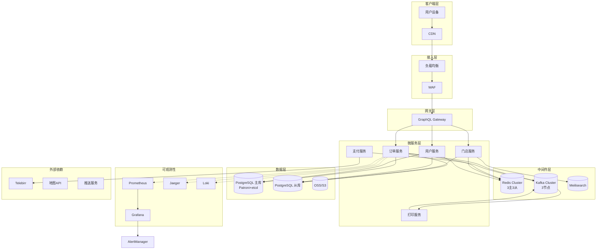

# E-Joy V2.2 产品设计文档（完整最终版）

> **版本**：V2.2  
> **更新日期**：2026-04-03  
> **作者**：技术合伙人（兼产品经理）  
> **定位**：基于 V2.0/V2.1 及多轮审查建议，整合服务员端、餐厅管理员端、系统后台端、订单自动打印、外卖配送、客户管理、店铺会员管理，并完成架构高可用、数据模型完善、API 规范化、流程闭环及可观测性建设。形成覆盖堂食、自提、外卖的完整餐厅数字化运营闭环，具备企业级生产就绪能力。

---

## 目录

1. [产品概述](#1-产品概述)
2. [角色与权限矩阵](#2-角色与权限矩阵)
3. [服务员端功能设计](#3-服务员端功能设计)
4. [餐厅管理员端功能设计](#4-餐厅管理员端功能设计)
5. [系统后台端功能设计](#5-系统后台端功能设计)
6. [打印功能设计](#6-打印功能设计)
7. [外卖配送功能设计](#7-外卖配送功能设计)
8. [客户管理功能设计](#8-客户管理功能设计)
9. [店铺会员管理功能设计](#9-店铺会员管理功能设计)
10. [系统架构设计](#10-系统架构设计)
11. [数据模型扩展](#11-数据模型扩展)
12. [API 设计](#12-api-设计)
13. [UI 设计提示词](#13-ui-设计提示词)
14. [非功能需求](#14-非功能需求)
15. [开发计划与里程碑](#15-开发计划与里程碑)
16. [附录：Out of Scope & 依赖清单](#16-附录out-of-scope--依赖清单)

---

## 1. 产品概述

### 1.1 产品定位

**E-Joy** 是一套面向餐厅的数字化解决方案，覆盖顾客端自助点餐、支付、会员；服务员端呼叫响应、绩效推广；餐厅管理员端员工、客户、会员、打印机、配送管理；系统后台端平台运营。V2.2 在之前版本基础上，强化了系统高可用、数据一致性、可观测性，并补齐了所有审查建议中的关键功能，实现从下单到履约、从员工激励到客户运营的完整闭环。

### 1.2 目标用户

| 角色 | 描述 | 使用场景 | 终端 |
|------|------|----------|------|
| 顾客 | 到店用餐或外卖消费者 | 扫码点餐、支付、查看订单、使用优惠券、会员 | 移动端 H5/App |
| 服务员 | 餐厅一线服务人员 | 接收呼叫、处理订单、查看绩效、推广 App | 移动端 H5/小程序 |
| 餐厅管理员 | 餐厅经营者或店长 | 管理员工、客户、会员、配置考核规则、打印机、配送规则 | Web 管理后台 |
| 配送员 | 餐厅自配送人员 | 接单、取餐、送达 | 移动端 H5/小程序 |
| 系统管理员 | 平台运营人员 | 管理餐厅入驻、审核优惠券、查看平台数据 | Web 系统后台 |

### 1.3 核心业务目标（OKR）

- **目标 1**：顾客端下单成功率 ≥ 99.5%（P0）
- **目标 2**：服务员呼叫平均响应时长 ≤ 60 秒（P1）
- **目标 3**：外卖订单占整体订单比例 ≥ 20%（V2.2 目标）
- **目标 4**：系统可用性 ≥ 99.95%（月故障时长 < 22 分钟）

---

## 2. 角色与权限矩阵

| 功能模块 | 服务员 | 配送员 | 餐厅管理员 | 系统管理员 |
|----------|:------:|:------:|:----------:|:----------:|
| 登录认证 | ✅ | ✅ | ✅ | ✅ |
| 查看呼叫列表 | ✅ | ❌ | ✅ | ❌ |
| 处理呼叫 | ✅ | ❌ | ❌ | ❌ |
| 个人绩效看板 | ✅ | ❌ | ❌ | ❌ |
| 生成推广码 | ✅ | ❌ | ❌ | ❌ |
| 订单补打 | ✅ | ❌ | ❌ | ❌ |
| 配送任务接单 | ❌ | ✅ | ❌ | ❌ |
| 标记取餐/送达 | ❌ | ✅ | ❌ | ❌ |
| 员工管理 | ❌ | ❌ | ✅ | ❌ |
| 客户管理 | ❌ | ❌ | ✅ | ❌ |
| 会员管理 | ❌ | ❌ | ✅ | ❌ |
| 考核规则配置 | ❌ | ❌ | ✅ | ❌ |
| 打印机配置 | ❌ | ❌ | ✅ | ❌ |
| 配送范围/规则配置 | ❌ | ❌ | ✅ | ❌ |
| 经营报表 | ❌ | ❌ | ✅ | ❌ |
| 打印日志 | ❌ | ❌ | ✅ | ❌ |
| 餐厅入驻审核 | ❌ | ❌ | ❌ | ✅ |
| 平台优惠券管理 | ❌ | ❌ | ❌ | ✅ |
| 平台数据大盘 | ❌ | ❌ | ❌ | ✅ |

---

## 3. 服务员端功能设计

（保持之前设计，增加超时重试、并发控制等优化，详见附录）

**关键优化**：
- 呼叫响应接口增加幂等键，防止重复响应
- 呼叫列表支持 WebSocket 实时推送，弱网自动重连
- 推广码生成使用短链 + 二维码，防枚举（增加验证码）

---

## 4. 餐厅管理员端功能设计

（保持之前设计，增加客户管理、会员管理、配送员管理）

**关键优化**：
- 所有写操作接口要求幂等键，防止重复提交
- 列表接口强制分页（最大 size=100），支持排序、筛选
- 敏感操作记录审计日志（删除员工、修改考核规则、修改配送配置）

---

## 5. 系统后台端功能设计

（保持之前设计，增加平台数据大盘告警配置）

---

## 6. 打印功能设计

（保持之前设计，增加异步打印队列、失败重试及订单状态 `PRINT_FAILED`）

**关键优化**：
- 打印服务从 Kafka 消费任务，异步发送到打印机，避免阻塞
- 失败重试 3 次（指数退避），仍失败则更新订单状态为 `PRINT_FAILED`，服务员端可手动补打
- 打印任务保留 30 天，超期自动归档

---

## 7. 外卖配送功能设计

### 7.1 功能概述

- 顾客可选择外卖配送，填写收货地址（支持地图选址）
- 餐厅管理员设置配送半径、配送费规则（固定/阶梯）、营业时段
- 配送员端：接单、取餐、送达，更新配送状态
- 订单状态增加：`WAITING_PICKUP`（待取餐）、`DELIVERING`（配送中）、`DELIVERED`（已送达）

### 7.2 关键优化

- 地址校验使用第三方地图 API，超时 3 秒降级为手动确认（记录降级日志）
- 配送费计算基于实际驾车距离（地图 API），并快照到订单
- 配送任务与订单一对一，配送员接单后锁定任务，防止重复接单
- 订单配送状态变更通过 WebSocket 实时推送给顾客

---

## 8. 客户管理功能设计

### 8.1 功能清单

- **本店顾客列表**：展示所有在本店下过单的顾客（手机号脱敏），支持按手机号/昵称搜索、按标签筛选、按总消费额/最近消费时间排序
- **顾客详情页**：展示顾客档案（会员等级、累计消费、订单历史、常用地址、优惠券使用记录）
- **顾客标签系统**：管理员可手动打标签（如“高消费”），系统自动生成标签（如“30天未消费”）
- **顾客消费报表**：新客数量、复购率、流失率、客单价分布

### 8.2 关键优化

- 标签使用软删除，历史映射保留
- 自动标签每日凌晨更新（基于规则引擎）
- 列表接口支持分页（最大 size=100）、导出 CSV

---

## 9. 店铺会员管理功能设计

### 9.1 功能清单

- **会员列表**：展示本店所有会员（等级、累计消费、入会时间、状态）
- **会员等级配置**：管理员可自定义等级名称、消费门槛、折扣百分比、免配送费、生日礼包（优惠券模板）
- **升降级规则**：配置自动升级/降级规则（如每月1日执行），历史会员等级变更记录到 `membership_level_change_log`
- **会员权益展示**：顾客端动态展示当前等级权益

### 9.2 关键优化

- 等级配置版本化（`effective_from`/`effective_to`），变更不追溯历史会员
- 升降级定时任务支持重试，失败告警
- 会员列表支持按等级、状态筛选及导出

---

## 10. 系统架构设计

### 10.1 部署架构图



### 10.2 高可用保障

- **数据库**：Patroni + etcd 自动故障转移（RTO < 30s），读写分离
- **Redis**：Cluster 模式 3 主 3 从，开启 AOF 持久化
- **Kafka**：3 节点集群，topic 副本数 3
- **服务**：K8s Deployment 多副本（≥2），HPA 自动扩缩
- **限流**：网关层限流（令牌桶），接口级限流（见 API 设计）

### 10.3 可观测性

- 日志：结构化 JSON 输出，Loki 采集，保留 30 天
- 链路追踪：OpenTelemetry + Jaeger，采样率 10%（错误全采样）
- 指标：Prometheus 暴露 QPS、延迟、错误率、Redis 命中率、MQ lag
- 告警：关键指标 P1 电话告警（订单成功率 < 95%），P2 钉钉通知

---

## 11. 数据模型扩展

（完整 Prisma Schema 见附录，此处列出核心新增和优化）

### 11.1 核心表审计字段统一

所有核心业务表（`Shop`, `Product`, `Order`, `Staff`, `CustomerTag`, `MembershipType` 等）均包含：
```prisma
createdAt   DateTime @default(now())
updatedAt   DateTime @updatedAt
createdBy   String?
updatedBy   String?
isDeleted   Boolean @default(false)
deletedAt   DateTime?
```

### 11.2 新增实体

```prisma
// 配送员
model DeliveryMan { ... }
// 配送任务
model DeliveryTask { ... }
// 菜品价格历史
model ProductPriceHistory { ... }
// 客户标签
model CustomerTag { ... }
model CustomerTagMapping { ... }
// 会员等级（扩展权益）
model MembershipType { ... }
// 审计日志
model AuditLog { ... }
// 绩效规则版本化
model PerformanceRule { ... }  // 含 effectiveFrom/effectiveTo
```

### 11.3 订单状态枚举（完整）

```prisma
enum OrderStatus {
  PENDING
  WAITING_CONFIRM
  WAITING_PAYMENT
  PAID
  PREPARING
  READY
  DELIVERING
  DELIVERED
  COMPLETED
  CANCELLED
  PAYMENT_FAILED
  REFUND_REQUESTED
  REFUNDED
  PRINT_FAILED
}
```

### 11.4 索引优化

- `Order`: `(delivery_type, status, created_at)`, `(delivery_man_id, status)`
- `OrderItem`: `(product_id)`
- `CustomerTagMapping`: `(shop_id, customer_id)`
- `PrintJob`: `(status, created_at)` 用于清理

---

## 12. API 设计

### 12.1 通用规范

- 所有 REST API 路径前缀 `/v1/`
- 认证：Bearer Token（JWT），从请求头 `Authorization` 获取
- 幂等键：所有写操作（POST/PUT/PATCH/DELETE）要求 `Idempotency-Key` 请求头
- 分页：列表接口统一使用 `page`（0-indexed）、`size`（≤100）、`sort` 参数，返回 `PageResponse`
- 错误响应统一格式（见下文）

### 12.2 统一错误响应

```json
{
  "error": {
    "code": "ORDER_NOT_FOUND",
    "message": "The order you requested does not exist.",
    "userMessage": "订单不存在，请刷新后重试。",
    "traceId": "uuid",
    "timestamp": "2026-04-03T10:30:00Z",
    "details": { "orderId": "123" }
  }
}
```

### 12.3 限流策略

| 接口 | 限流规则 |
|------|----------|
| `POST /v1/staff/login` | 5 次/分钟/IP |
| `POST /v1/orders` | 10 次/分钟/用户 |
| `POST /v1/staff/calls/{callId}/respond` | 30 次/分钟/服务员 |
| `POST /v1/admin/orders/{orderId}/confirm` | 60 次/分钟/管理员 |

### 12.4 关键接口示例

#### 创建订单（外卖）

```http
POST /v1/orders
Idempotency-Key: 8f1e2d3c-4b5a-6c7d-8e9f-0a1b2c3d4e5f
Authorization: Bearer <token>
Content-Type: application/json

{
  "shopKey": "shop123",
  "deliveryType": "DELIVERY",
  "addressId": "addr_456",
  "items": [{"productId": "prod_789", "amount": 2}],
  "paymentMethod": "TELEBIRR",
  "paymentTime": "FIRST",
  "couponCode": "SAVE10"
}
```

响应：
```json
{
  "orderId": "ord_abc",
  "status": "WAITING_CONFIRM",
  "totalAmount": 2500,
  "deliveryFee": 500
}
```

#### 管理员确认接单

```http
POST /v1/admin/orders/{orderId}/confirm
Idempotency-Key: <uuid>
Authorization: Bearer <admin_token>
```

响应：
```json
{
  "orderId": "ord_abc",
  "status": "PREPARING"
}
```

#### 获取顾客列表（分页）

```http
GET /v1/admin/customers?page=0&size=20&sort=totalSpent,desc&tagIds=tag1,tag2&search=张三
Authorization: Bearer <admin_token>
```

响应：
```json
{
  "content": [
    {
      "id": "user_1",
      "phone": "138****1234",
      "nickname": "张三",
      "totalSpent": 12500,
      "tags": [{"id": "tag1", "name": "高消费"}]
    }
  ],
  "page": {"number": 0, "size": 20, "totalElements": 105, "totalPages": 6},
  "sort": {"sortedBy": "totalSpent", "direction": "DESC"}
}
```

### 12.5 GraphQL 增强

- 查询深度限制 maxDepth=10，字段数限制 maxAliases=50
- 持久化查询（生产环境）
- 错误扩展字段统一包含 `code`, `userMessage`, `traceId`

---

## 13. UI 设计提示词

（保持原有 Figma Make 提示词，补充客户管理、会员管理、配送员端页面）

**客户管理页**（餐厅管理员 Web）

```
Design a web page for restaurant manager to manage customers.

- Sidebar: Customers (active)
- Search bar: by phone/nickname, filter by tags (multi-select)
- Table: Phone (masked), Nickname, First Order, Last Order, Total Spent, Tags (chips), Actions (View Details)
- Each row has "View Details" modal: order history, address list, member info, tag management (add/remove tags)
- Export CSV button
```

**会员等级配置页**

```
Design a membership tier configuration page.

- List of existing tiers (Basic, Silver, Gold, Platinum) with edit icons.
- Click edit: modal with fields: name, spending threshold (birr), discount (%), free delivery toggle, birthday coupon selector.
- Add new tier button.
- Save button.
```

**配送员端任务列表**（移动端）

```
Design a mobile task list for delivery man.

- Top: "Today's Deliveries"
- Tabs: Pending, In Progress, Completed
- Card: Order number, pickup address (restaurant), delivery address, customer name, phone.
- Buttons: "Pick Up" (when arrived), "Delivered" (when completed).
- Navigation: Tasks, Profile.
```

---

## 14. 非功能需求

### 14.1 性能指标

| 指标 | 目标 | 测试条件 |
|------|------|----------|
| API P95 响应时间 | < 500ms | 200 并发，4G 网络 |
| 订单创建成功率 | ≥ 99.5% | 压测 1000 订单/分钟 |
| 呼叫推送延迟 | < 2s | WebSocket 长连接 |
| 打印成功率 | ≥ 99.5% | 打印机在线 |
| 客户列表查询 | < 1s | 1000 顾客，带标签筛选 |

### 14.2 安全要求

- 所有 API 需要 JWT 认证（除登录、健康检查）
- 管理员接口必须校验 `shopId` 归属，防止跨店越权
- 手机号默认脱敏（`138****1234`），明文需二次验证
- 密码 bcrypt 加密（cost=10）
- SQL 注入防护：使用 Prisma ORM 参数化查询
- 限流：网关层 + 接口级

### 14.3 可用性

- 系统可用性 ≥ 99.95%（月故障时长 < 22 分钟）
- 数据库主从自动切换 RTO < 30s
- Redis 集群容忍单节点故障

### 14.4 可扩展性

- 所有服务无状态，支持水平扩展
- 订单表按月分区（保留 3 年）
- 日志表按时间轮转归档

---

## 15. 开发计划与里程碑

### 15.1 迭代规划

| 阶段 | 时间 | 内容 | 交付物 |
|------|------|------|--------|
| Sprint 0 | 第 1 周 | 环境搭建、数据库高可用、Redis 集群 | 基础架构就绪 |
| Sprint 1 | 第 2-3 周 | 服务员端核心功能 | 呼叫响应、绩效看板、推广码 |
| Sprint 2 | 第 4-5 周 | 管理员端基础功能 | 员工管理、打印机配置、配送配置 |
| Sprint 3 | 第 6 周 | 打印服务 + 外卖配送 | 自动打印、地址管理、配送员端 |
| Sprint 4 | 第 7 周 | 客户管理 + 会员管理 | 顾客列表、标签、会员等级配置 |
| Sprint 5 | 第 8 周 | 系统后台端 + 报表 | 餐厅审核、平台优惠券、数据大盘 |
| Sprint 6 | 第 9 周 | 可观测性 + 集成测试 | 日志、链路、监控、告警、端到端测试 |
| Sprint 7 | 第 10 周 | 性能压测 + 生产部署 | 压测报告、上线 |

### 15.2 关键里程碑

- Week 3：服务员端可用
- Week 5：管理员端可管理员工、打印机、配送
- Week 6：外卖配送可用
- Week 7：客户与会员管理可用
- Week 10：全功能生产上线

---

## 16. 附录：Out of Scope & 依赖清单

### 16.1 本期不做（Out of Scope）

- 自动退款到原支付账户（需 Telebirr 支持）
- 发票电子版生成
- 连锁门店数据汇总
- 顾客端评价系统（V2.3）
- 微信/支付宝支付
- 配送员实时轨迹追踪

### 16.2 外部依赖清单

| 依赖 | 用途 | 备选方案 | 成本/限制 |
|------|------|----------|-----------|
| 高德/Google Maps API | 地址解析、距离计算 | 手动输入（降级） | 免费额度内 |
| Telebirr 支付 | 在线支付 | 仅现金 | 无额外费用 |
| Firebase Cloud Messaging | 离线推送 | 极光推送 | 免费额度内 |
| ESC/POS 打印机 | 小票打印 | — | 硬件成本 |
| PostgreSQL (Patroni) | 数据库高可用 | 云数据库 RDS | 按需付费 |

### 16.3 数据迁移计划

- 为已有订单设置 `deliveryType = DINE_IN`
- 为已有用户不预置地址（需手动添加）
- 为已有产品设置 `stock = -1`（无限）
- 执行迁移前备份数据库

---

**文档结束**